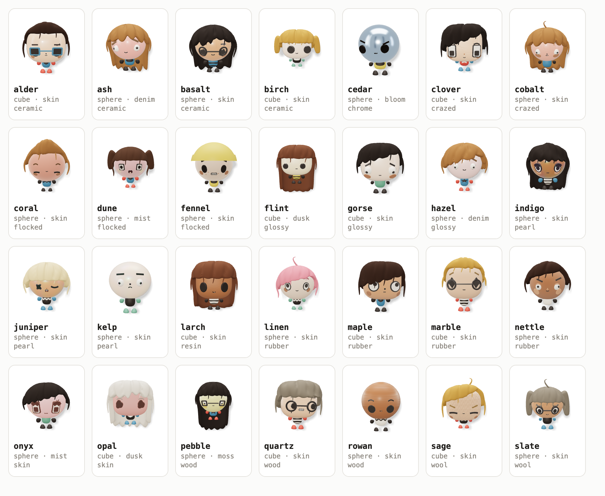

# The avatar roster

Twenty-eight characters, frozen in `client/src/lib/gloss/roster.ts`. This sheet is here so the next
person can see what exists without running anything — it is rendered from the committed roster, at
the size a card draws, on the app's own paper.

Each caption is the entry's `id` and then the three axes that vary: body form, palette, material.
Every entry is `species: "humanoid"` and `stance: "biped"`; those two do not vary and are not
printed. What is not in the caption is the **seed**, and it is most of what makes these twenty-eight
different people: the haircut, the eyes, the nose, the mouth and the shade of the skin all come out
of it. Two entries with identical axes and different seeds are two different characters, which is
why the roster commits a seed at all.

## Changing this list

An `id` is what `agents.avatar_id` stores and what migration 068's backfill hashes into **by index
in sort order**. So:

- **Appending** is safe.
- **Removing** an entry orphans every agent wearing it.
- **Re-pointing** an id at a different recipe changes those agents' faces without touching a row.
- **Re-ordering** moves every backfilled agent to a different avatar.

`test:gloss-roster` re-derives the sort rather than trusting it, and also asserts the curation rules
this set was picked under — humanoid, biped, all eleven materials present, both body forms, nothing
whose resolved body colour or hair reads amber. Regenerate this image after any change to the array;
the harness that draws it is described in `PROVENANCE.md` under the extraction notes.

## How they were chosen

The pass is written up in `roster.ts`'s own header and in `docs/avatars/decisions.md` (D1). The
short version: a candidate sheet of seventy-seven was rendered across every material and every
allowed palette, looked at **at 96px rather than at contact-sheet size**, and cut to the ones that
are still telling apart from each other at that size. Silhouette does the separating — thirteen hair
styles including two bald heads, both body forms, glasses on seven.
